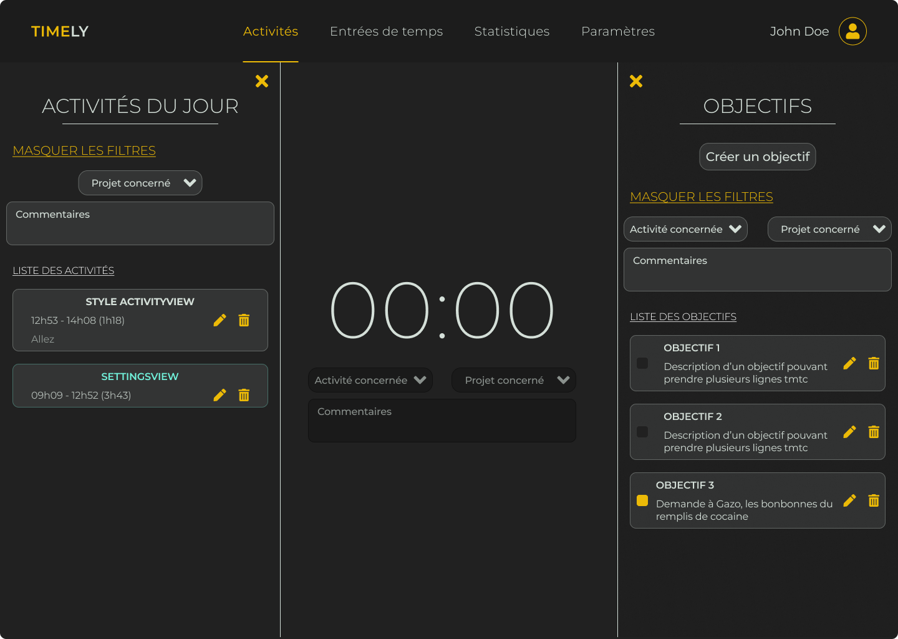
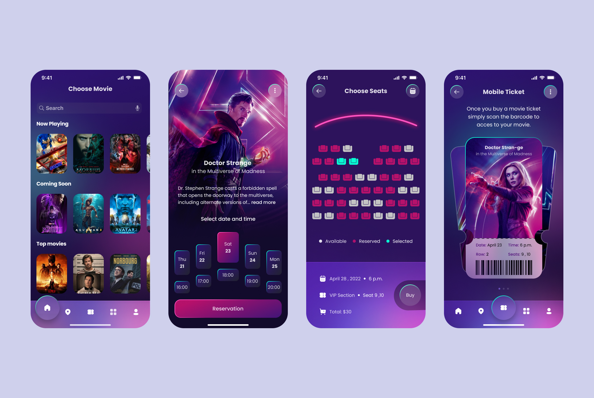

# Portfolio d'Elian Arnaud

## 1) Formation et Parcours

Je suis actuellement étudiant en troisième année du Bachelor Universitaire de Technologie (BUT) en Informatique. Ce programme m'a permis d'acquérir des connaissances approfondies dans divers domaines de l'informatique, notamment le développement logiciel, les bases de données, les réseaux informatiques, et plus encore. Les objectifs de cette formation étaient clairs : fournir aux étudiants une base solide en informatique combinée à des compétences pratiques nécessaires pour réussir dans le monde professionnel.

Dans l'ensemble, la formation correspondait à mes attentes. Les cours dispensés étaient pertinents et mis à jour par rapport aux avancées technologiques. De plus, les projets pratiques et les stages proposés m'ont permis de mettre en pratique mes connaissances théoriques dans des situations réelles, ce qui a renforcé ma compréhension et ma confiance dans mes compétences en informatique.

Cependant, je dois admettre que les travaux de groupe étaient une facette moins agréable de cette expérience. En effet, ces travaux ne testent pas nos capacités individuelles de manière adéquate, car beaucoup ne participent pas activement et comptent sur les autres pour faire le travail à leur place. Cette année, il y avait même plus de travaux de groupe que les années précédentes, ce qui a rendu cette expérience encore plus frustrante.

## 2) Résultats du semestre

### B3 - Informatique PT RA (APP)

### SEMESTRE 5 BUT INFO ALT DEVELOPPEMENT WEB ET MOBILE

| Code      | Libellé                                        | Note | Rang |
|-----------|------------------------------------------------|------|------|
| 5JEH1N02  | Pôle Ressources UE 5-1                         | 15.215 | |
| 5JRH1N02  | PPP R5.02                                      | 13.5 | 35/40 |
| 5JRH1N04  | Qualité algorithmique R5.RA.04                 | 15.25 | 8/40 |
| 5JRH1N04E1| Projet Qualité algorithmique CC                | 15 | |
| 5JRH1N04E2| DS Qualité algorithmique                        | 15.5 | |
| 5JRH1N07  | Automatisation de la production R5.RA.07       | 16 | 1/40 |
| 5JRH1N13  | Economie numérique et durable R5.RA.13         | 13 | 24/40 |
| 5JRH1N14  | Anglais R5.RA.14                               | 17.25 | 9/40 |
| 5JEH1N07  | Pôle SAE UE 5-1                                | | |
| 5JUH1N05  | UE 5-2 Optimiser                               | | |
| 5JEH1N04  | Pôle Ressources UE 5-2                         | 14.89 | |
| 5JRH1N05  | Programmation avancée R5.RA.05                 | 17.79 | 4/40 |
| 5JRH1N08  | Qualité de développement R5.RA.08              | 15.25 | 8/40 |
| 5JRH1N09  | Virtualisation avancée R5.RA.09                | 12 | 17/40 |
| 5JRH1N10  | Nouveaux paradigmes BD R5.RA.10                | 16 | 1/40 |
| 5JRH1N10E1| Projet Nouveaux paradigmes BD                  | 16.5 | |
| 5JRH1N10E2| DS Nouveaux paradigmes BD                      | 15.5 | |
| 5JRH1N11  | Optimisation pour l'aide à la décision R5.RA.11| 11 | 13/40 |
| 5JRH1N12  | Modélisations mathématiques R5.RA.12           | 13.5 | 35/40 |
| 5JEH1N08  | Pôle SAE UE 5-2                                | | |
| 5JAH1N03  | Développement avancé SAE5.01                   | | |
| 5JMH1N01  | Projet application web et mobile SAE5.01.1     | 15 | |
| 5JMH1N03  | Services Web et interopérabilité SAE5.01.3    | 12 | |
| 5JUH1N06  | UE 5-6 Collaborer                              | | |
| 5JEH1N06  | Pôle Ressources UE 5-6                         | 14.033 | |
| 5JRH1N01  | Initiation au management d'une équipe R5.01    | 12 | 21/40 |
| 5JRH1N03  | Politiques de communication R5.03              | 13.5 | 32/40 |
| 5JRH1N06  | Programmation multimédia R5.RA.06              | 14.5 | 1/40 |

## 3) Ressources

## Projet Timely (fait en Vue.JS)
[Projet Timely (Vue.JS)](ressources/Timely.png)
  
## Projet Personnel StudIncursion (Maquette)
[Projet Personnel StudIncursion](ressources/StudIncursion.jpg)
  
## Projet Personnel Swapply (Maquette)
[Projet Personnel Swapply](ressources/Swapply.jpg)
  
## Projet Personnel Movie Ticket Booking (Maquette)
[Projet Personnel Movie Ticket Booking](ressources/Movie.jpg)
  

## 4) GitHub

Dans mon portfolio, je présente mes résultats académiques pour l'année universitaire 2023/2024. J'explique ma formation et mon parcours dans le Bachelor Universitaire de Technologie (BUT) en Informatique, soulignant les connaissances acquises et les objectifs de la formation.

Je suis globalement satisfait de ma formation, mais les travaux de groupe ont été moins agréables. Je trouve qu'ils ne testent pas efficacement nos capacités individuelles, surtout avec le nombre croissant de travaux cette année.

Les résultats académiques sont présentés sous forme de tableau pour une vue claire de mes performances dans chaque matière.

En résumé, mon portfolio offre un aperçu de mes réalisations académiques tout en exprimant mes réflexions sur ma formation et mes expériences en travaux de groupe.
